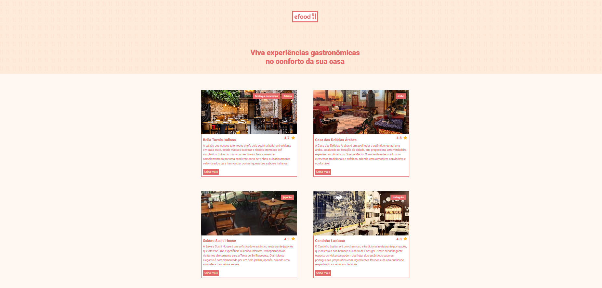

# 🍔 EFOOD React

Aplicação web de delivery desenvolvida com React, TypeScript e Redux Toolkit, simulando uma plataforma moderna de pedidos online.

O projeto permite visualizar restaurantes, acessar cardápios individuais, adicionar produtos ao carrinho e concluir pedidos através de um checkout completo com validações, integração com API e experiência responsiva para desktop e dispositivos móveis.

---

## 🚀 Deploy

🔗 https://efood-react-rosy.vercel.app/

---

## 📸 Preview



---

## ✨ Funcionalidades

- Listagem dinâmica de restaurantes
- Página individual para cada restaurante
- Visualização de cardápios
- Carrinho lateral dinâmico
- Controle de quantidade de produtos
- Checkout em múltiplas etapas
- Validação completa de formulários
- Máscaras para inputs
- Integração com API REST
- Geração automática de ID do pedido
- Feedback visual durante carregamentos
- Limpeza automática do carrinho após compra
- Responsividade para mobile e desktop
- Scroll lock ao abrir o carrinho
- Hover effects e transições suaves
- Experiência de usuário otimizada (UX)

---

## 🛠️ Tecnologias utilizadas

<div style="display: inline_block"><br/>


</div>

### Stack utilizada

- React
- TypeScript
- Redux Toolkit
- RTK Query
- React Router DOM
- Styled Components
- Vite
- ESLint

---

## 📚 Aprendizados

Durante o desenvolvimento deste projeto foram aplicados conceitos importantes de desenvolvimento Front-end moderno, incluindo:

- Gerenciamento de estado global com Redux Toolkit
- Componentização e reutilização de componentes
- Organização de arquitetura Front-end
- Consumo de APIs REST
- Manipulação de estados assíncronos
- Validação de formulários
- Responsividade
- Boas práticas com React e TypeScript
- Experiência do usuário (UX/UI)

---

## ⚙️ Como executar o projeto

Clone o repositório:

```bash
git clone https://github.com/kaio-oliveira5/efood-react.git

Acesse a pasta do projeto:

cd efood-react

Instale as dependências:

npm install

Execute a aplicação:

npm run dev
📌 Status do projeto

✅ Projeto finalizado

👨‍💻 Autor

Desenvolvido por Kaio Oliveira

🔗 GitHub:
https://github.com/kaio-oliveira5

🔗 LinkedIn:
https://www.linkedin.com/in/kaio-oliveira-683698362
